# 🚗 YOLO Object Detection Pipeline

An end‑to‑end implementation of the YOLO object detection system in TensorFlow/Keras.  
From raw input images ➝ model inference ➝ bounding box drawing ➝ organized visual outputs — this repo brings together all pieces of a modern object detection pipeline.

---

## Project Highlights

This repository demonstrates a **complete YOLOv2-style detection system**, implemented from scratch:

1. **Preprocessing**  
   Load images → resize to model input size (608×608)

2. **Model Inference**  
   Custom-built `yolo_head` to decode predictions from YOLO output layers

3. **Post-Processing**  
   - Convert `(x, y, w, h)` to corners  
   - Filter out low-confidence boxes  
   - Apply **Non-Max Suppression (NMS)**  
   - Rescale boxes to original image size

4. **Prediction Visualization**  
   Draw bounding boxes and class labels using Matplotlib/patches

5. **Output Export**  
   - Save raw input images  
   - Save predictions (images with bounding boxes)  
   - Generate side-by-side comparison images  
   - Create side-by-side **comparison videos** from sequences

---

## Directory Structure

```bash
yolo-object-detection-pipeline/
│
├── images/                # Raw input images
├── originals/             # Copied raw images (for export)
├── predictions/           # YOLO predictions (boxes drawn)
├── both_images/           # Side-by-side comparison frames (original + predicted)
├── test_images/           # Sample inputs with predictions
│   ├── cars.jpg
│   ├── cars_pred.png
│   ├── giraffe.jpg
│   └── giraffe_pred.png
├── videos/                # Video outputs
│   ├── output_video_orig.mp4      # Original-only video
│   ├── output_video_pred.mp4      # Predicted-only video
│   └── output_video_both.mp4      # Side-by-side comparison video
├── model_data/            # Model weights, anchors, and class labels
│   ├── saved_model.pb
│   ├── yolo_anchors.txt
│   ├── coco_classes.txt
│   ├── pascal_classes.txt
│   └── variables/
└── notebook.ipynb         # Full interactive pipeline demo
```

## Sample Predictions

### cars.jpg

| Original | YOLO Prediction |
|----------|------------------|
|  | 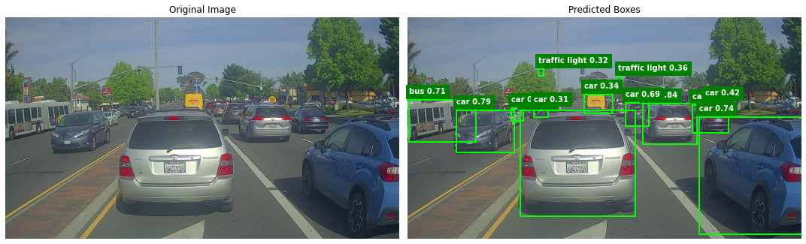 |

---

### giraffe.jpg

| Original | YOLO Prediction |
|----------|------------------|
|  | 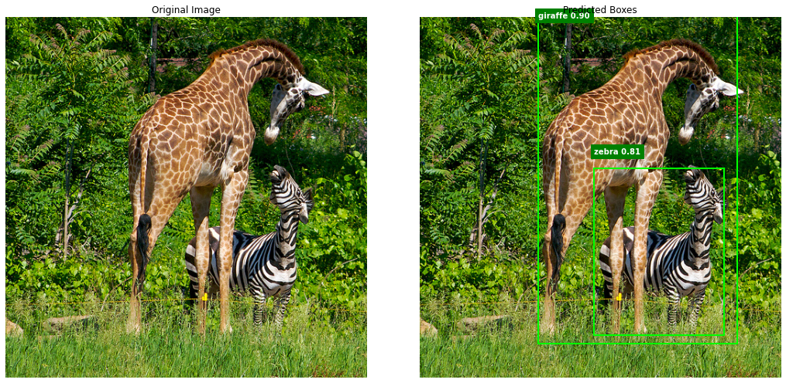 |

---

## More Visuals: Originals vs Predictions

### Sample Comparisons from `/originals` and `/predictions`

| Original | Prediction |
|----------|------------|
| 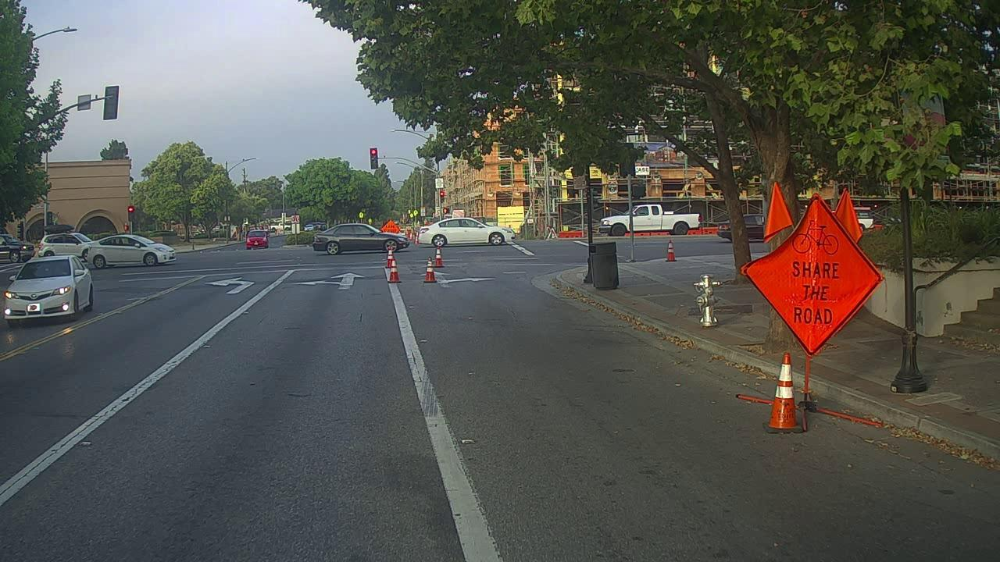 | 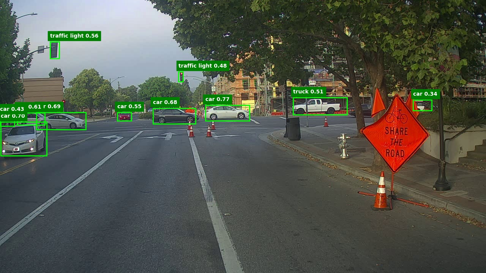 |
| 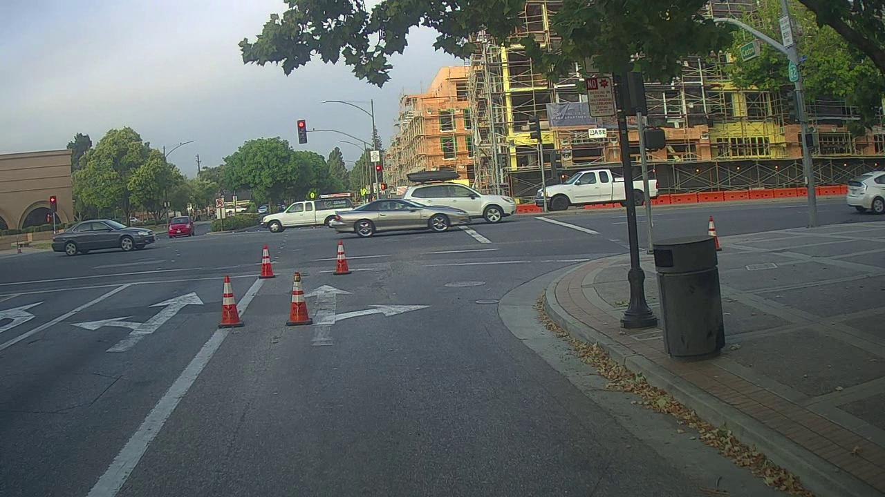 | 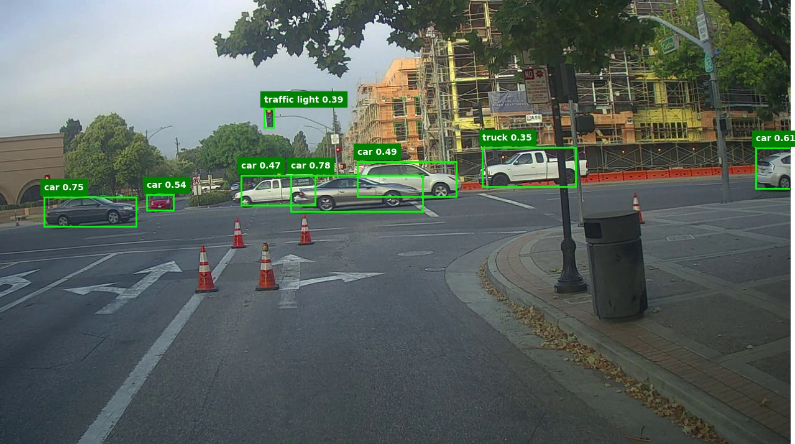 |
| 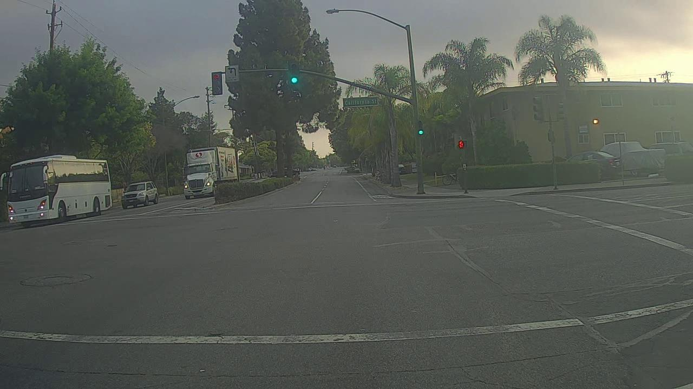 | 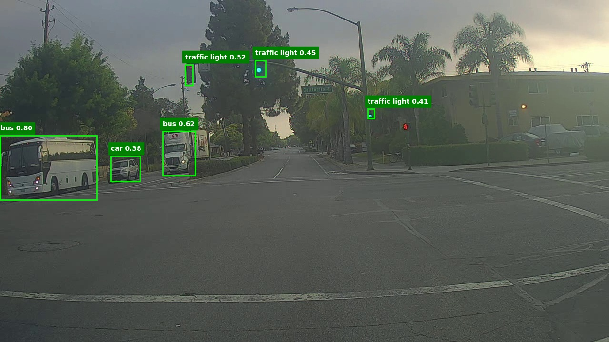 |
| 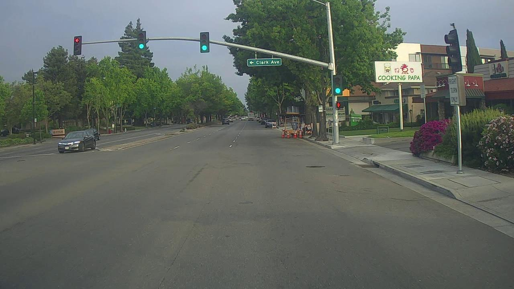 | 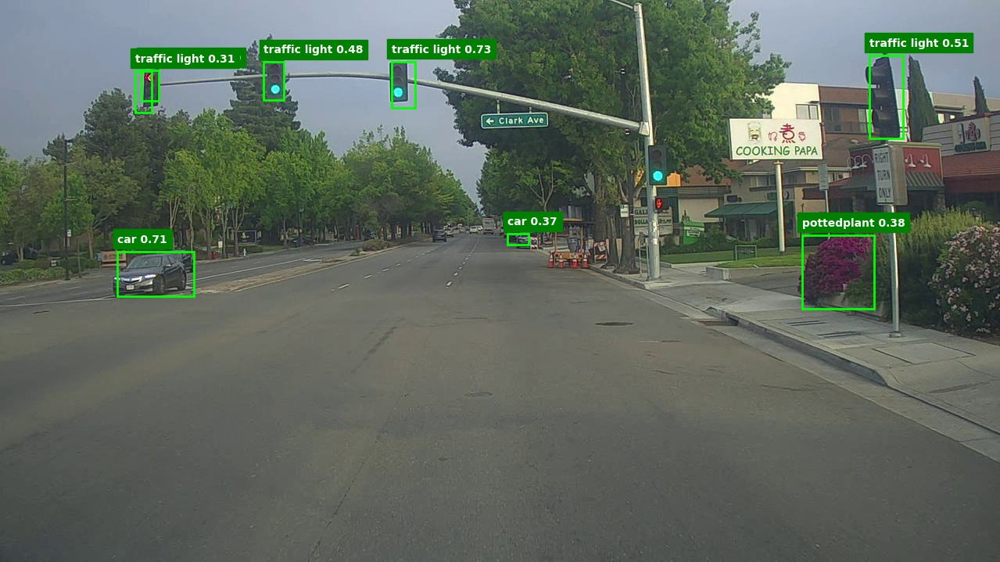 |
| 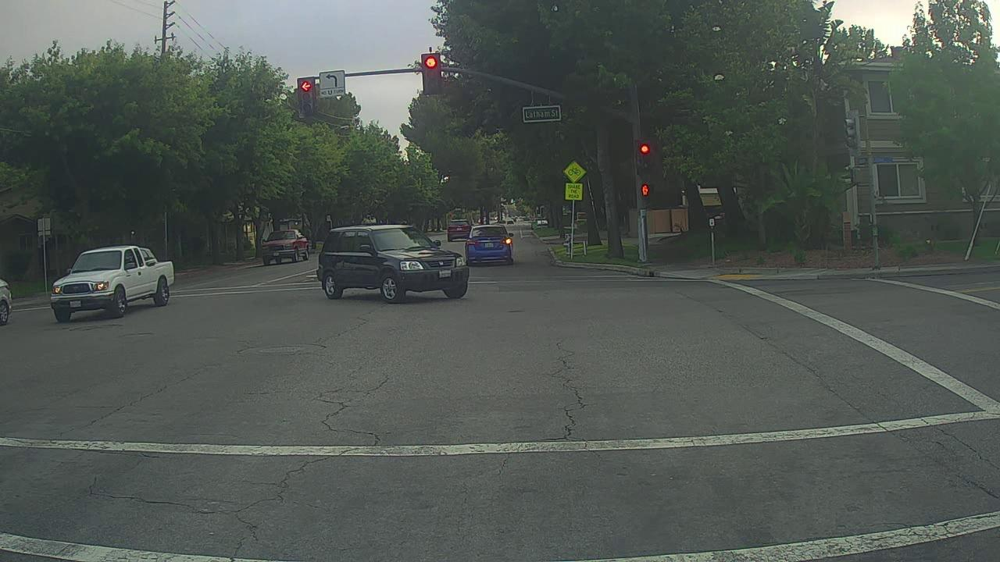 | 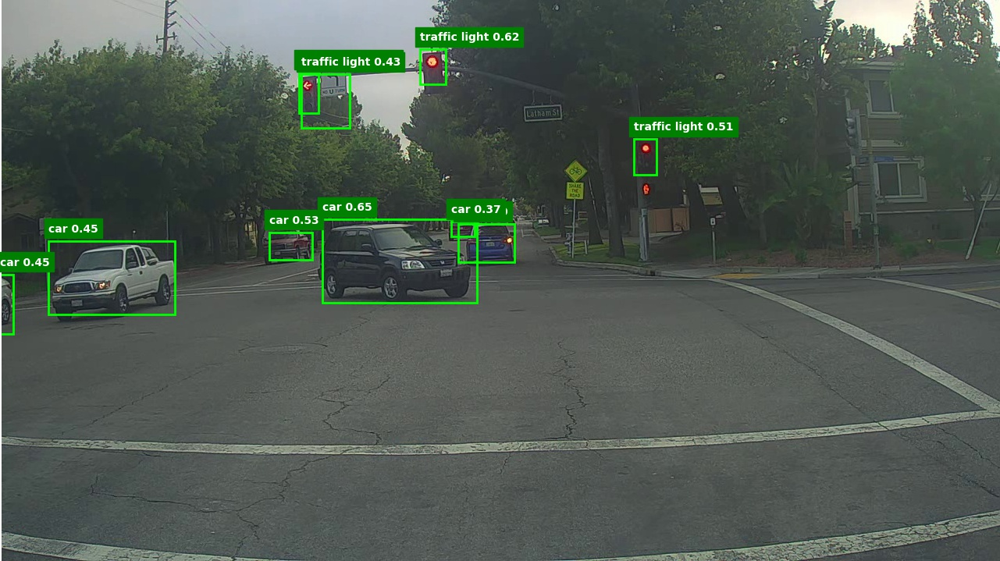 |
| 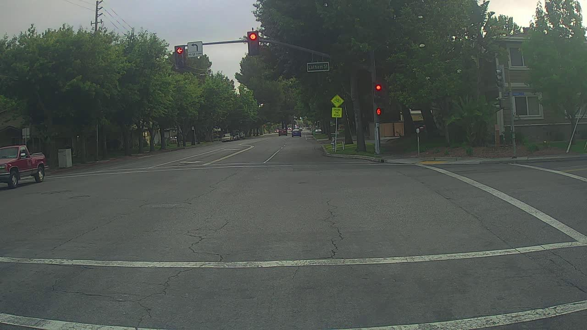 | 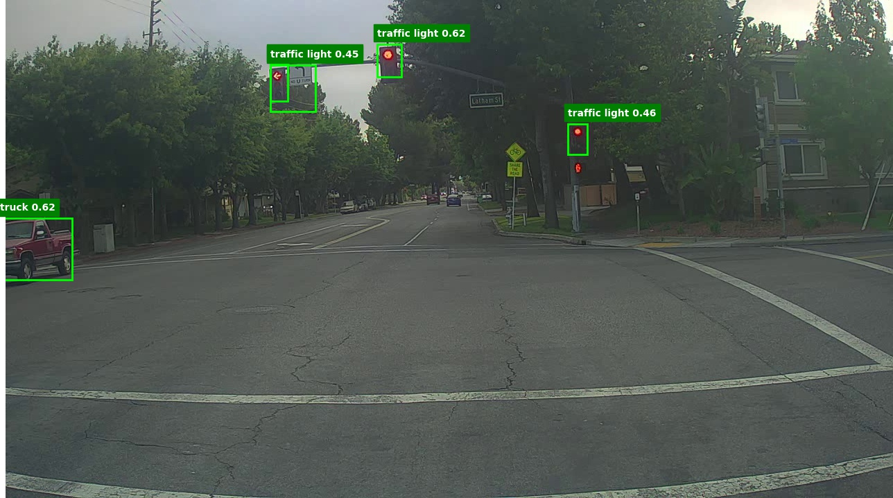 |
---

## Example Videos

These videos demonstrate the YOLO pipeline in action - from original input sequences to prediction overlays and side-by-side comparisons.

> **Click to download or right-click to view in browser (hosted via GitHub repo paths):**

| Description                  | File Link |
|-----------------------------|-----------|
| Original Input Sequence  | [output_video_orig.mp4](videos/output_video_orig.mp4) |
| YOLO Predictions Only     | [output_video_pred.mp4](videos/output_video_pred.mp4) |
| Side-by-Side Comparison  | [output_video_both.mp4](videos/output_video_both.mp4) |

---

## Quick Start

1. **Clone the repo**  
   ```bash
   git clone https://github.com/yourusername/yolo-object-detection-pipeline.git
   cd yolo-object-detection-pipeline
   ```

## 👨‍💻 Author

**Nabeel Shan**  
Software Engineering Student - NUST Islamabad  
Aspiring AI Researcher | AI/ML Enthusiast  
[LinkedIn](https://www.linkedin.com/in/nabeelshan) • [GitHub](https://github.com/nabeelshan78)  
- Currently focused on mastering CNNs, YOLO, and ResNet architectures.
- Mastering Deep Learning architectures through hands-on work
- Looking to collaborate on AI/ML projects or research opportunities

---

## ⭐ Star the Repo

If you found this helpful, please consider **starring** 🌟 the repository - it helps others discover this resource and motivates continued open-source contributions.

---
